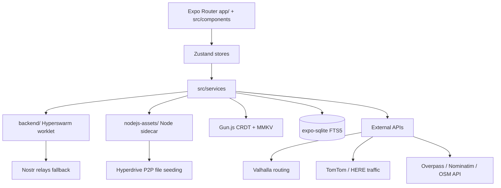

# Architecture — Polaris Maps

## System Overview

Polaris Maps is a **peer-to-peer (DePIN) mapping application**: every running device is a node in a decentralized physical infrastructure network. It provides turn-by-turn navigation, live traffic, POI search, transit planning, offline region packs, street-level imagery, and OSM editing — with identity, data sync, and content distribution handled P2P rather than by a corporate cloud.

The app is a React Native + Expo application with three interlocking P2P systems (Hyperswarm for peer discovery, Hyperdrive for file replication, Gun.js for CRDT data sync), a Node.js sidecar for Hyperdrive, a Bare worklet for the Hyperswarm traffic mesh, and commercial APIs used as enrichment/fallback sources.

## Major Components

### Application layer (`app/`, `src/`)

- **`app/`** — Expo Router screens: `(tabs)`, `poi/`, `regions/`, `imagery/`, `places/`, `onboarding/`, `settings/`. Root layout: `app/_layout.tsx`.
- **`src/components/`** — UI: map, navigation, search, poi, regions, imagery, dashboard, places, common.
- **`src/stores/`** — Zustand stores: `map`, `traffic`, `osmPoi`, `navigation`, `transit`, `poi`, `placeList`, `peer`.
- **`src/services/`** — domain logic, each with its own README: `traffic`, `routing`, `geocoding`, `poi`, `search`, `transit`, `imagery`, `regions`, `sync`, `identity`, `osm`, `carplay`, `places`, `favorites`, `icloud`.
- **`src/hooks/`, `src/contexts/`, `src/models/`, `src/utils/`, `src/constants/`, `src/types/`, `src/native/`, `src/atproto/`** — supporting code.

### P2P bridge

| System                     | Runtime                                                                                                                         | Role                                                                                                                                                                                 |
| -------------------------- | ------------------------------------------------------------------------------------------------------------------------------- | ------------------------------------------------------------------------------------------------------------------------------------------------------------------------------------ |
| **Hyperswarm**             | `backend/` — Bare worklet via `react-native-bare-kit`, bundled with bare-pack into committed `backend/traffic-swarm.bundle.mjs` | DHT peer discovery on geohash4 topic channels; encrypted streams for traffic probes, POI updates, attestations. Falls back to Nostr relays (event kind `20100`) when peer count < 3. |
| **Hyperdrive / Hypercore** | `nodejs-assets/nodejs-project/` — Node.js sidecar (`index.js`, CommonJS)                                                        | File replication: downloaded region packs are seeded back to the network; tar extraction; IPC bridge to the RN layer.                                                                |
| **Gun.js**                 | In-app, with an MMKV storage adapter                                                                                            | CRDT eventual-consistency store for POI edits, reviews, ratings, attestations, reputation.                                                                                           |

### Identity

No accounts or password servers. First launch generates a secp256k1 keypair stored in the OS secure enclave (iOS Keychain / Android Keystore via `expo-secure-store`). All actions (POI edits, reviews, traffic probes) are Schnorr-signed. Proof-of-presence attestation proves proximity (~100 m) to a POI without revealing exact location.

### Storage

- **expo-sqlite** (FTS5) — local place indexes and search.
- **react-native-mmkv** — fast local persistence; offline action queue (capped at 500 entries, replayed on reconnect).
- **expo-secure-store** — identity keypair and secrets.

### Native layer (`ios/`, `android/`, `plugins/`, `fastlane/`)

- `ios/` and `android/` are generated by `expo prebuild` (edit via `app.json` + config plugins, not directly).
- `plugins/` — Expo config plugins: `withValhalla` (Valhalla native routing), `withSceneLifecycle`, `withXcode16Fixes`.
- CarPlay — navigation state, maneuvers, and search forwarded to CarPlay templates (`src/services/carplay`, `scripts/install-carplay-simulator.sh`, `scripts/doctor-carplay-simulator.sh`).
- `fastlane/` — local iOS builds: `beta` (TestFlight), `release` (App Store), `validate` lanes.

## Directory Map

```
.
├── app/                      # Expo Router screens
├── src/                      # App code (components, services, stores, hooks, …)
├── backend/                  # Hyperswarm worklet (separate npm package, bare-pack bundle)
├── nodejs-assets/
│   └── nodejs-project/       # Node.js sidecar (Hyperdrive/Corestore)
├── ios/  android/            # Generated native projects
├── plugins/                  # Expo config plugins
├── patches/                  # pnpm patches
├── scripts/                  # Data generation, CarPlay sim, MapKit token, metro cache
├── fastlane/                 # iOS build/release automation
├── __tests__/                # unit / integration / benchmark suites
├── docs/                     # ios-release.md, architecture, development
├── openspec/  .specify/  specs/  # Spec-driven development artifacts
├── app.json  eas.json  package.json  pnpm-workspace.yaml
└── index.js                  # Metro entry
```

## Application Entry Points

| Entry                     | Path                                                                       |
| ------------------------- | -------------------------------------------------------------------------- |
| Metro bundle entry        | `index.js` (per `package.json` `main`)                                     |
| Expo Router root          | `app/_layout.tsx`                                                          |
| Hyperswarm worklet source | `backend/traffic-swarm.mjs` (bundled → `backend/traffic-swarm.bundle.mjs`) |
| Node sidecar entry        | `nodejs-assets/nodejs-project/index.js`                                    |
| iOS automation            | `fastlane/Fastfile`                                                        |

## Data Flow (confirmed relationships)



Key flows:

1. **Traffic** — anonymous speed probes broadcast on geohash4 Hyperswarm topics; fused with TomTom + HERE feeds; 25%+ delay triggers automatic rerouting.
2. **Region downloads** — region packs (vector tiles, routing graphs, geocoding indexes) downloaded, then seeded back via Hyperdrive.
3. **Search** — 3-phase: local Overture SQLite → parallel Overpass + Overture → Nominatim; MapKit enriches selected POIs on iOS.
4. **Offline** — outbound actions queue in MMKV (cap 500) and replay on reconnect.
5. **OSM editing** — OAuth 2.0 + PKCE login, live node state fetch, changesets via OSM API v0.6.

## External Service Integrations

| Service                                       | Purpose                                                                |
| --------------------------------------------- | ---------------------------------------------------------------------- |
| TomTom Traffic Flow v4 / HERE Traffic Flow v7 | Commercial traffic feeds (fallback/enrichment)                         |
| Valhalla                                      | Turn-by-turn routing (online + offline graph tiles)                    |
| Overpass, Nominatim, Photon                   | OSM-based search/geocoding fallbacks                                   |
| Overture Maps                                 | POI data (SQLite local + PMTiles remote)                               |
| OpenTripPlanner, MBTA V3, Amtrak BTS          | Transit planning                                                       |
| MapKit (Apple)                                | POI enrichment, MapKit tokens (iOS)                                    |
| Nostr relays                                  | P2P fallback channel (kind `20100`)                                    |
| GitHub Releases                               | Region map data distribution (built weekly by `build-region-data.yml`) |

## Authentication / Authorization

- **Device identity**: secp256k1 keypair + Schnorr signatures; no central auth. Reputation computed from contribution history.
- **OSM**: OAuth 2.0 + PKCE.
- **API keys**: commercial keys shipped as `EXPO_PUBLIC_*` env vars (inlined at bundle time); Apple MapKit JWT generated via `scripts/generate-mapkit-token.mjs`; App Store Connect API key used by Fastlane/CI only.

## Background Jobs & Scheduled Tasks

- **In-app**: offline action queue replay; background location for traffic contribution.
- **CI (`build-region-data.yml`)**: weekly (Sun 00:00 UTC) OSM → Valhalla tiles + PMTiles + geocoding DB build, published to GitHub Releases; also on push to `scripts/regions.json`/workflow and manual dispatch.
- **CI (`ios-testflight.yml`)**: manual TestFlight build/upload via Fastlane.

## Observability & Error Handling

- No centralized logging/metrics system was found in the repository.
- Graceful degradation is a stated design goal: Nostr fallback when Hyperswarm peers < 3; offline queue + replay; local-first search.
- Log files at repo root (`*.log`, `build_output*.txt`) are local debugging artifacts and are gitignored.
- CI runs the test suite in advisory mode (`continue-on-error`) due to known pre-existing failures.

## Assumptions & Unknowns

- `src/atproto/` and `@atproto/*` dependencies are present (Bluesky/AT Protocol), but its exact product role was not established from the audit — see service READMEs before changing.
- Detox e2e configurations (`.detoxrc`) and several `jest.*.config.js` files referenced by package scripts were not found in the repo at audit time.
- The README tech-stack table lists older versions than `package.json` (Expo 52 vs 57); treat `package.json` as authoritative.
